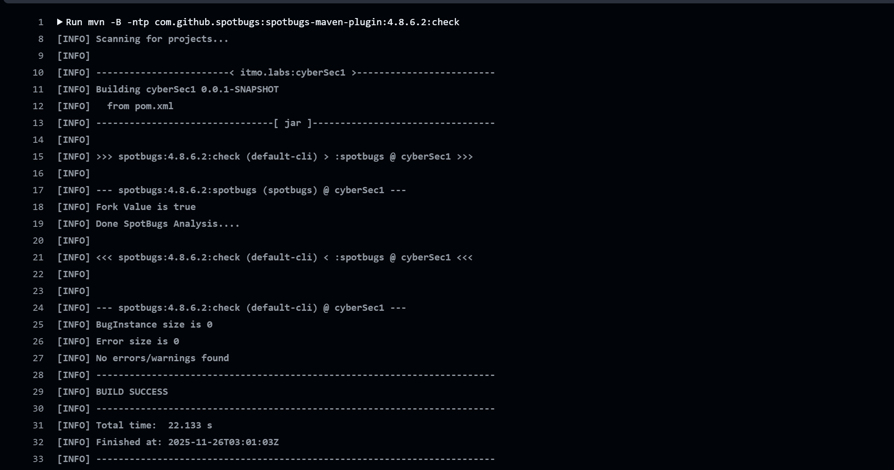
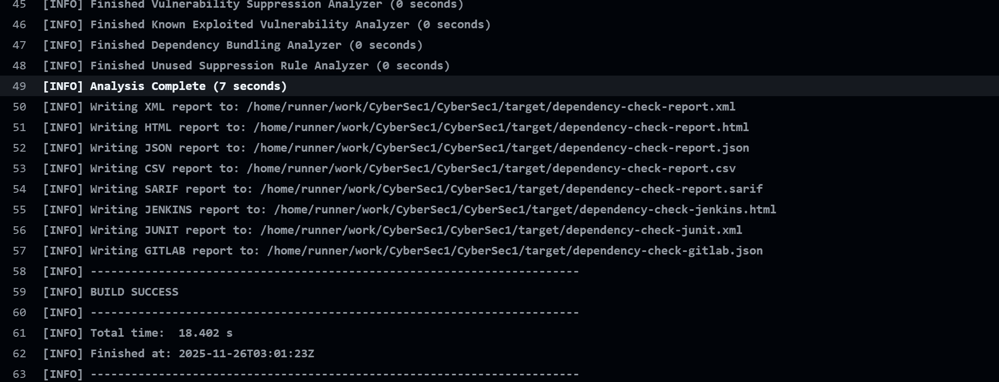
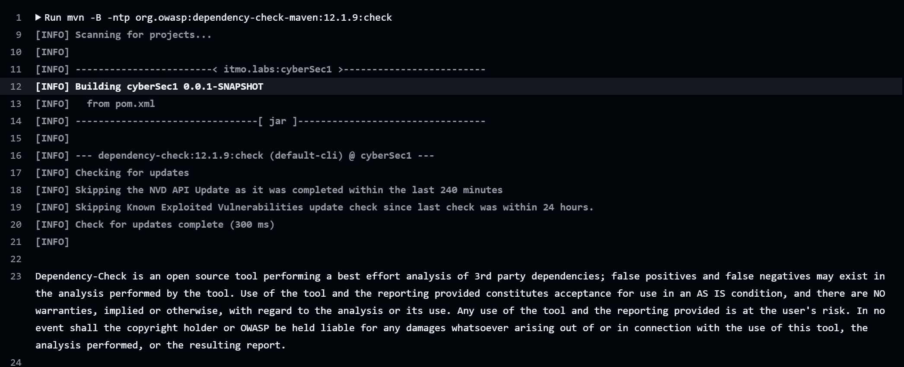

- Стек: Spring Boot 3.5, Spring Security, Spring Data JPA, Liquibase, PostgreSQL, JWT (jjwt 0.13.x), Jsoup, Maven
- DevSecOps: SpotBugs (SAST) и OWASP Dependency-Check (SCA) в GitHub Actions
- Язык Java: 21

1) Требования
- JDK 21
- Maven 3.9+
- PostgreSQL 13+

2) Переменные окружения (.env)
Проект читает настройки из файла .env (см. src/main/resources/application.yaml → spring.config.import: optional:file:.env[.properties]). Пример:

```
DB_URL=jdbc:postgresql://localhost:5432/cybersec
DB_USERNAME=postgres
DB_PASSWORD=postgres
JWT_SECRET=BASE64_256_BIT_KEY
JWT_EXPIRATION_MS=3600000
SERVER_PORT=8080
```

3) Миграции БД
Liquibase применит схему автоматически при старте (changelog-master.yaml, 25-01-changelog.sql).

## API: эндпоинты и примеры
Все эндпоинты, кроме /auth/login, требуют заголовок Authorization: Bearer <JWT>.

Базовый URL по умолчанию: http://localhost:8080

1) POST /auth/login — аутентификация
- Тело запроса (JSON):
```
{
  "login": "user1",
  "password": "secret"
}
```
- Успешный ответ (200):
```
{
  "token": "<JWT>"
}
```
- Ошибки: 401 (неверные учётные данные)

2) GET /api/me — профиль текущего пользователя
- Заголовок: `Authorization: Bearer <JWT>`
- Ответ (200):
```
{
  "id": 1,
  "name": "Ivan",
  "surname": "Ivanov",
  "login": "user1"
}
```
- Ошибки: 401 (нет или неверный токен)

3) GET /api/data — список пользователей (санитизированные поля)
- Заголовок: `Authorization: Bearer <JWT>`
- Ответ (200):
```
[
  { "id": 1, "name": "Ivan", "surname": "Ivanov", "login": "user1" },
  { "id": 2, "name": "Petr", "surname": "Petrov", "login": "user2" }
]
```
- Ошибки: 401 (нет или неверный токен)

Примеры curl
- Логин: 
```
curl -X POST http://localhost:8080/auth/login \
  -H "Content-Type: application/json" \
  -d '{"login":"user1","password":"secret"}'
```
- Запрос с токеном:
```
TOKEN="<вставьте_полученный_JWT>"
curl http://localhost:8080/api/me -H "Authorization: Bearer $TOKEN"
```

## Аутентификация и авторизация
- Stateless: сессии отключены (SessionCreationPolicy.STATELESS)
- Логин: UserService.login(..) через AuthenticationManager → DaoAuthenticationProvider → CustomUserDetailsService
- Пароли: PasswordEncoder = BCrypt (SecurityConfig.passwordEncoder).
- JWT: 
  - Генерация: JwtService.generateToken(..) с HS256
  - Время жизни: app.jwt.expiration-ms (по умолчанию 3600000 мс = 1 час)
  - Верификация: JwtAuthenticationFilter извлекает токен из Authorization, проверяет подпись и срок действия, подставляет аутентификацию в SecurityContext
- Доступ: 
  - /auth/login — permitAll
  - всё остальное — требуется авторизация

## Реализованные меры защиты

1) Защита от SQL Injection
- Используется Spring Data JPA (UserRepository extends JpaRepository) с параметризованными запросами и без конкатенации SQL-строк в коде
- Типичный метод: `Optional<User> findByLogin(String login)` → под капотом PreparedStatement
- Liquibase управляет схемой, что снижает риск ошибочных ручных миграций

2) Защита от XSS
- Выходная санитизация с помощью Jsoup: SanitizationService.sanitize(..)
- Санитизация применяется при формировании DTO в UserService (методы getData и me), удаляя HTML/скрипты из отображаемых полей name/surname/login

3) Безопасное хранение и проверка паролей
- BCryptPasswordEncoder с адаптивной сложностью (Spring Security)
- CustomUserDetailsService загружает пользователя и передаёт хэш пароля в провайдер аутентификации.

4) JWT и управление сессиями
- Подпись HS256, проверка подписи и срока действия токена
- Токен содержит только идентификатор (subject = login) без чувствительных данных
- При неверном или просроченном токене доступ отклоняется (401)
- В JwtService есть защитная логика на случай неверного секрета: при некорректном значении app.jwt.secret генерируется временный ключ.

5) CSRF и CORS
- CSRF отключён, так как используется stateless JWT и отсутствует cookie-сессия
- CORS включён с настройками по умолчанию (`cors(Customizer.withDefaults())`).

6) Прочее
- Версии зависимостей управляются Spring Boot, дополнительные проверки уязвимостей выполняются в CI

## DevSecOps: SAST / SCA в CI/CD
В репозитории настроен GitHub Actions workflow (.github/workflows/ci.yml), который запускается на push/pull_request и выполняет:

1) Сборку Maven (`mvn -DskipTests=true clean verify`)
2) SAST: SpotBugs (`mvn com.github.spotbugs:spotbugs-maven-plugin:check`)
3) SCA: OWASP Dependency-Check (`mvn org.owasp:dependency-check-maven:check`)
4) Публикацию отчётов как artifacts (видны в разделе Actions → конкретный запуск → Artifacts)

Артефакты:
- SpotBugs: target/spotbugsXml.xml, spotbugsXml.html, spotbugs.html, spotbugsXml.json
- Dependency-Check: target/dependency-check-report.* (HTML, XML, JSON)

### Скриншоты отчётов (добавьте свои изображения ниже)

Разместите скриншоты в папке `docs/screenshots` (создайте при необходимости) и вставьте пути к файлам в блоки ниже.

#### SAST (SpotBugs)



#### SCA (OWASP Dependency-Check)




## Структура и ключевые классы
- Контроллер: `UserController` — эндпоинты /auth/login, /api/me, /api/data
- Безопасность: `SecurityConfig` (конфигурация), `JwtAuthenticationFilter` (извлечение и проверка токена)
- Аутентификация: `CustomUserDetailsService` (загрузка пользователя), `UserService.login` (аутентификация и выдача JWT)
- JWT: `JwtService` (генерация/проверка токена)
- Санитизация: `SanitizationService` (Jsoup.clean с Safelist.none)
- Доступ к данным: `UserRepository` (Spring Data JPA), миграции — Liquibase